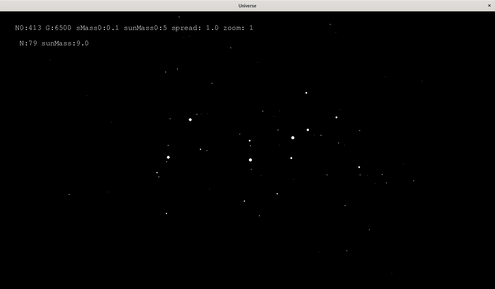

# universe
Basic implementation of the n-body problem.

# Screenshot

# Controls
  - space bar -> start simulation
  - a/q  -> increase/decrease number of initial bodies
  - z/s  -> +10/-10 for the number of initial bodies
  - e/d  -> increase/decrease the magnitude of the gravity
  - r/f  -> increase/decrease the mass factor
  - t/g  -> increase/decrease the mass of the sun
  - o/l  -> increase/dicrease the initial density of the bodies
